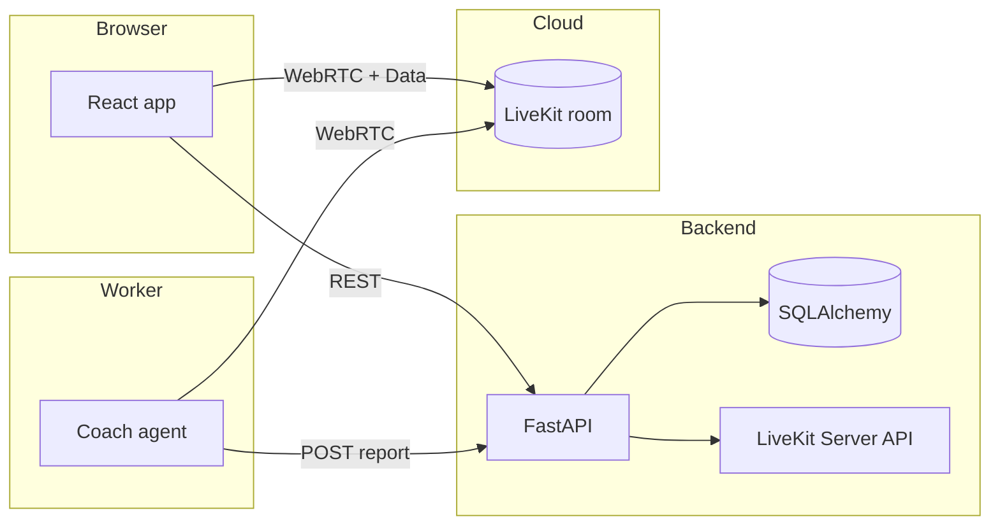

<div align="center">

# Interview Avatar Coach

**Real-time interview, presentation, and pressure-simulation coaching** — Hebrew-first UI, LiveKit rooms, OpenAI speech and models, and optional Beyond Presence avatar.

[](https://github.com/YOUR_GITHUB_USERNAME/interviewAvatar/actions/workflows/ci.yml)
[](https://www.python.org/downloads/)
[](https://nodejs.org/)
[](LICENSE)

[Features](#-features) · [Architecture](#-architecture) · [Quick start](#-quick-start) · [Environment](#-environment-variables) · [API](#-api) · [Deploy](#-deployment-render) · [Troubleshooting](#-troubleshooting)

</div>

---

## Overview

Interview Avatar Coach is a full-stack reference app: users configure a coaching session in the browser, join a **LiveKit** room for live audio/video with an AI coach, use **NEXT / DONE** controls to pace the session, and read a structured **report** served by **FastAPI**.

| Layer | Stack |
|--------|--------|
| **Web** | React 18, TypeScript, Vite, `livekit-client`, React Router |
| **API** | FastAPI, SQLAlchemy, LiveKit Server API (rooms + JWT) |
| **Agent** | `livekit-agents`, OpenAI STT/TTS, Silero VAD, multilingual turn detection |

---

## Features

- **Session types** — Interview, presentation, or pressure simulation with type-specific options (role/level, topic/duration, scenario).
- **LiveKit** — Room creation, metadata (`sessionId` + `sessionConfig`), participant tokens.
- **RTL + Hebrew** — Global RTL layout and Hebrew copy in the coach prompts and UI.
- **Coach agent** — Listens on the room, reads config from metadata, multimodal-ready (latest camera frame appended on user turns when video is published).
- **Flow hooks** — UI sends reliable data messages (`COACH_ACTION`: `NEXT` / `DONE`) for future tight coupling with scripted steps.
- **Reports** — Agent POSTs structured JSON to the backend; Report page loads the latest report per session.
- **Avatar** — Beyond Presence hooks with **voice-only fallback** when avatar is unavailable (see `agent/avatar.py`).

---

## Architecture



**End-to-end flow**

1. **Session Builder** → `POST /api/sessions` with `sessionConfig`.
2. Backend creates/updates a LiveKit room with JSON metadata (`sessionId`, `sessionConfig`), stores the session row, returns `roomName`, `token`, `sessionId`, `livekitUrl`.
3. **Pre-join** → Camera/mic check; session payload is stored in `localStorage` as `sessionData`.
4. **Live room** → Client connects with the token and publishes A/V; **NEXT** / **DONE** publishes `COACH_ACTION` data packets.
5. Worker agent joins the same room, parses metadata, runs STT/LLM/TTS, handles actions, submits report on done.
6. **Report** → `GET /api/sessions/{id}/report`.

---

## Repository layout

```
interviewAvatar/
├── backend/                 # FastAPI service
│   ├── main.py              # Routes, Pydantic models
│   ├── models.py          # Session, Report ORM models
│   ├── db.py              # Engine, session dependency
│   ├── livekit_service.py # Rooms, metadata, JWT
│   └── migrations/        # Alembic (optional; see note below)
├── agent/                 # LiveKit Agents worker
│   ├── agent.py           # CoachAgent, session wiring
│   ├── avatar.py          # Beyond Presence / fallback
│   └── coach/             # config, prompts, flow, report
├── web/                   # Vite + React frontend
│   └── src/pages/         # Landing, SessionBuilder, PreJoin, LiveRoom, Report
├── render.yaml            # Render Blueprint (static + web + worker)
└── .github/workflows/     # CI
```

---

## Prerequisites

- **Python** 3.12+ (agent); 3.11+ may work for backend; repo targets 3.12 for the agent (`agent/pyproject.toml`).
- **Node.js** 20+ and npm.
- [**uv**](https://github.com/astral-sh/uv) (recommended for the agent): `pip install uv` or the official installer.
- Accounts/credentials for **LiveKit**, **OpenAI**, and optionally **Beyond Presence**.

---

## Quick start

### 1. Backend

```bash
cd backend
python -m venv .venv
.venv\Scripts\activate          # Windows
# source .venv/bin/activate     # macOS/Linux
pip install -r requirements.txt
```

Create `backend/.env` (see [Environment](#-environment-variables)). Initialize tables (app also runs `create_all` on startup):

```bash
# Optional: Alembic — ensure migrations match models or rely on init_db()
# alembic upgrade head
python main.py
```

The API listens on **http://127.0.0.1:8000** by default (`python main.py`).

### 2. Agent

```bash
cd agent
uv sync
```

Create `agent/.env.local` with API keys and LiveKit settings. Run in development:

```bash
uv run python agent.py dev
```

### 3. Web

```bash
cd web
npm install
```

Create `web/.env`:

```env
VITE_API_URL=http://127.0.0.1:8000
VITE_LIVEKIT_URL=wss://your-livekit-host
```

```bash
npm run dev
```

Vite serves on **http://localhost:3000**. Dev server proxies **`/api` → http://127.0.0.1:8000** (`vite.config.mts`). If `VITE_API_URL` is unset, **`SessionBuilder` and `Report` call `http://127.0.0.1:8000`** — same port as the default backend.

---

## Environment variables

### Backend (`backend/.env`)

| Variable | Required | Description |
|----------|----------|-------------|
| `LIVEKIT_URL` | Yes | WebSocket URL of your LiveKit server (e.g. `wss://…`) |
| `LIVEKIT_API_KEY` | Yes | LiveKit API key |
| `LIVEKIT_API_SECRET` | Yes | LiveKit API secret |
| `DATABASE_URL` | No | Default `sqlite:///./interview_avatar.db`; use Postgres in production |

`livekit_service.py` also loads `.env.local` if present.

### Agent (`agent/.env.local` or `.env`)

| Variable | Required | Description |
|----------|----------|-------------|
| `OPENAI_API_KEY` | Yes | OpenAI API key (STT/TTS; LLM may use LiveKit inference routing) |
| `LIVEKIT_URL` | Yes | Same as backend |
| `LIVEKIT_API_KEY` | Yes | Same as backend |
| `LIVEKIT_API_SECRET` | Yes | Same as backend |
| `BACKEND_URL` | No | Default `http://localhost:8000` — report POST target |
| `BEY_API_KEY` | No | Beyond Presence (optional) |
| `BEY_AVATAR_ID` | No | Avatar id (optional) |

### Web (`web/.env`)

| Variable | Required | Description |
|----------|----------|-------------|
| `VITE_API_URL` | Recommended | FastAPI base URL (e.g. `http://127.0.0.1:8000`) |
| `VITE_LIVEKIT_URL` | Yes* | LiveKit WebSocket URL (*or rely on `livekitUrl` from create-session response) |

---

## API

| Method | Path | Description |
|--------|------|-------------|
| `POST` | `/api/sessions` | Create session; body: `{ "sessionConfig": { "sessionType", "options" } }` |
| `GET` | `/api/sessions/{sessionId}` | Session details |
| `POST` | `/api/sessions/{sessionId}/report` | Save report (typically called by the agent) |
| `GET` | `/api/sessions/{sessionId}/report` | Latest report for the session |
| `GET` | `/health` | Health check |

Report JSON shape matches `ReportData` in `backend/main.py` (`summary`, `strengths`, `improvements`, optional `rewriteSuggestion`).

---

## Deployment (Render)

This repo includes [`render.yaml`](render.yaml) for a [Render Blueprint](https://render.com/docs/infrastructure-as-code):

1. Render → **New** → **Blueprint** → select this repository.
2. Set required secrets (`OPENAI_API_KEY`, LiveKit trio, plus `VITE_LIVEKIT_URL` for the static site).
3. Apply — provisions static frontend, FastAPI web service, and agent worker.

Update hard-coded hostnames inside `render.yaml` if your Render service names differ.

---

## Scripts and tooling

| Location | Command | Purpose |
|----------|---------|---------|
| `backend/` | `python main.py` | Run FastAPI with Uvicorn on port 8000 |
| `backend/` | `uvicorn main:app --reload --host 0.0.0.0 --port 8000` | Reloading dev server |
| `agent/` | `uv run python agent.py dev` | Local agent dev |
| `agent/` | `uv run python agent.py start` | Production-style start (Render worker) |
| `web/` | `npm run dev` | Vite dev server |
| `web/` | `npm run build` | Production build → `web/dist` |
| Repo root | `start.ps1` | Optional helper (Windows) |

---

## Troubleshooting

- **Frontend cannot reach API** — Run the backend on **8000** (default), or set `VITE_API_URL` and update the `/api` proxy `target` in `vite.config.mts` together.
- **`VITE_LIVEKIT_URL` / placeholder LiveKit URL** — LiveRoom blocks navigation if the URL is still the placeholder; set env or rely on backend returning `livekitUrl`.
- **`Report not found` after DONE** — The UI waits briefly then navigates; slow networks or delayed agent POST may require a refresh; consider polling in production.
- **LiveKit credential warnings on backend startup** — Ensure `.env`/`.env.local` in `backend/` contains all three LiveKit variables before creating rooms.

---

## Roadmap notes (maintainers)

- Tighter wiring of **NEXT/DONE** to explicit LLM turn scripts (beyond flow `print`/step counters).
- **Reports** grounded in transcript analysis rather than placeholders.
- **Avatar** wired to Beyond Presence SDK when credentials are provided.
- **Single source of truth** for DB schema: Alembic migrations vs `init_db()` `create_all`.

---

## Contributing

See [CONTRIBUTING.md](CONTRIBUTING.md).

---

## License

This project is licensed under the MIT License — see [LICENSE](LICENSE).

---

## Acknowledgements

Built with [LiveKit](https://livekit.io/), [FastAPI](https://fastapi.tiangolo.com/), [Vite](https://vitejs.dev/), and [OpenAI](https://openai.com/) APIs.

**Replace badges:** After you publish the repo under your GitHub user or org, swap `YOUR_GITHUB_USERNAME/interviewAvatar` in the README badge URLs for accurate CI shields.
