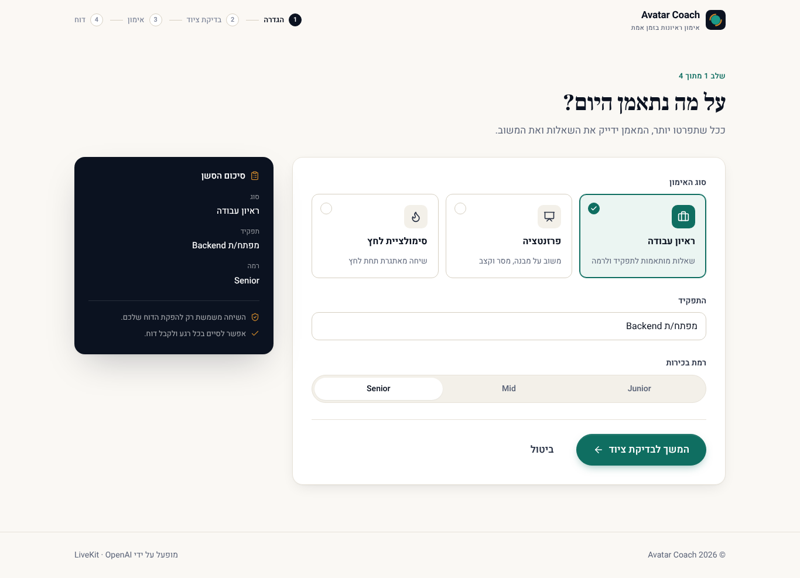
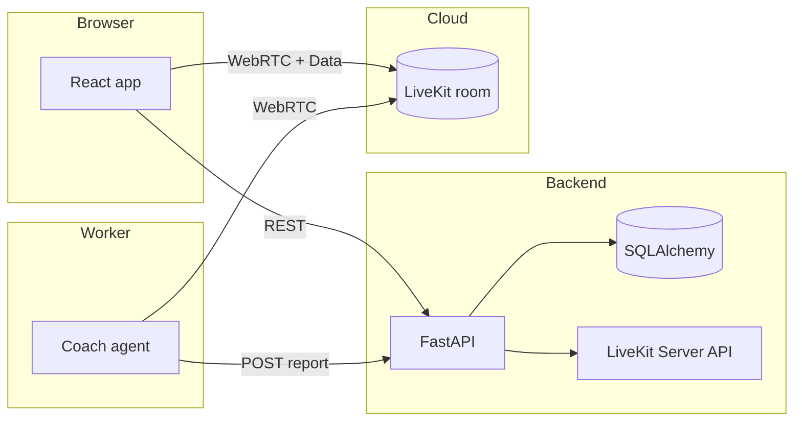

<div align="center">

# Interview Avatar Coach

**Real-time interview, presentation, and pressure-simulation coaching** — Hebrew-first UI, LiveKit rooms, OpenAI speech and models, and optional Beyond Presence avatar.

[](https://github.com/stato10/interviewAvatar/actions/workflows/ci.yml)
[](https://www.python.org/downloads/)
[](https://nodejs.org/)
[](LICENSE)

[Features](#features) · [Demo](#demo--screenshots) · [Architecture](#architecture) · [Quick start](#quick-start) · [Environment](#environment-variables) · [API](#api) · [Deploy](#deployment-render) · [Troubleshooting](#troubleshooting) · [GitHub settings](#github-repository-settings-maintainers)

</div>

---

## Overview

Interview Avatar Coach is a full-stack reference app: users configure a coaching session in the browser, join a **LiveKit** room for live audio/video with an AI coach, use **NEXT / DONE** controls to pace the session, and read a structured **report** served by **FastAPI**.

| Layer | Stack |
|--------|--------|
| **Web** | React 18, TypeScript, Vite, `livekit-client`, React Router, Lucide icons, IBM Plex Sans Hebrew |
| **API** | FastAPI, SQLAlchemy, LiveKit Server API (rooms + JWT) |
| **Agent** | `livekit-agents`, OpenAI STT/TTS, Silero VAD, multilingual turn detection |

---

## Demo & screenshots

**For recruiters / tech screen:** this is a **full-stack, real-time** demo — Hebrew **RTL** UI, **LiveKit** room, optional **camera** context for the coach, and a structured **report** after the session.

<p align="center">
  
</p>

<p align="center">
  
  
</p>

A live-room capture (coach orb, live transcript, controls) needs real LiveKit credentials — see [`docs/screenshots/README.md`](docs/screenshots/README.md).

---

## Features

- **Session types** — Interview, presentation, or pressure simulation with type-specific options (role/level, topic/duration, scenario).
- **LiveKit** — Room creation, metadata (`sessionId` + `sessionConfig`), participant tokens.
- **RTL + Hebrew** — Global RTL layout and Hebrew copy in the coach prompts and UI.
- **Coach agent** — Listens on the room, reads config from metadata, multimodal-ready (latest camera frame appended on user turns when video is published).
- **Session controls** — **NEXT** makes the coach give quick feedback and move on; **DONE** triggers a spoken wrap-up and the report (`COACH_ACTION` data messages on topic `coach`).
- **Live captions** — Real-time transcript of both sides (LiveKit text streams), agent state indicator (listening / thinking / speaking).
- **AI reports** — On DONE (or when the user just leaves) the agent analyses the transcript with an LLM (structured JSON output), POSTs it to the backend with a shared secret, and notifies the browser (`REPORT_READY`). The Report page polls until it lands.
- **Avatar** — Optional Beyond Presence avatar (`BEY_API_KEY`) with automatic **voice-only fallback**.

---

## Architecture


```mermaid
flowchart LR
  subgraph Browser
    WEB[React app]
  end
  subgraph Backend
    API[FastAPI]
    DB[(SQLAlchemy)]
    LK_API[LiveKit Server API]
  end
  subgraph Cloud
    LK[(LiveKit room)]
  end
  subgraph Worker
    AG[Coach agent]
  end

  WEB -->|REST| API
  WEB -->|WebRTC + Data| LK
  AG -->|WebRTC| LK
  API --> DB
  API --> LK_API
  AG -->|POST report| API
```

**End-to-end flow**

1. **Session Builder** → `POST /api/sessions` with `sessionConfig`.
2. Backend creates/updates a LiveKit room with JSON metadata (`sessionId`, `sessionConfig`), stores the session row, returns `roomName`, `token`, `sessionId`, `livekitUrl`.
3. **Pre-join** → Camera/mic preview with a level meter; device choices are carried into the room.
4. **Live room** → Client connects with the token, publishes A/V, plays the coach's audio, shows live captions; **NEXT** / **DONE** publish `COACH_ACTION` data packets.
5. The agent worker is dispatched to the room, reads metadata, runs STT → LLM → TTS, reacts to actions, and on DONE (or shutdown) analyses the transcript and POSTs the report, then sends `REPORT_READY`.
6. **Report** → polls `GET /api/sessions/{id}/report` until the report is available.

---

## Repository layout

```
interviewAvatar/
├── backend/                 # FastAPI service
│   ├── main.py              # Routes, Pydantic models
│   ├── models.py          # Session, Report ORM models
│   ├── db.py              # Engine, session dependency
│   ├── livekit_service.py # Rooms, metadata, JWT
│   └── migrations/        # Alembic (run automatically on startup)
├── agent/                 # LiveKit Agents worker
│   ├── agent.py           # CoachAgent, session wiring
│   ├── settings.py        # Env-driven configuration
│   ├── avatar.py          # Beyond Presence / fallback
│   └── coach/             # config, prompts, flow, report
├── web/                   # Vite + React frontend
│   └── src/
│       ├── lib/           # API client, protocol, types, storage
│       └── pages/         # Landing, SessionBuilder, PreJoin, LiveRoom, Report
├── scripts/               # Maintainer helpers (e.g. GitHub About + Topics sync)
├── render.yaml            # Render Blueprint (static + web + worker)
└── .github/workflows/     # CI
```

---

## Quick start

You only need to add keys. Everything else is configured.

```bash
python scripts/setup.py          # creates .env, generates AGENT_API_KEY, lists what's missing
# edit .env: OPENAI_API_KEY + the three LIVEKIT_* values
python scripts/setup.py          # run again until it says "Ready"
docker compose up --build        # backend :8000, agent, web :3000
```

Open **http://localhost:3000**.

**No LiveKit Cloud account?** Run a local LiveKit server too. Then only `OPENAI_API_KEY` is needed:

```bash
python scripts/setup.py --local-livekit
docker compose -f compose.yaml -f compose.livekit.yaml up --build
```

### Demo mode (no keys at all)

A scripted walkthrough for showing the product: the coach reads a fixed script with the browser's voice, live captions appear, and the session ends with a sample report. It is clearly labelled as a demo.

- **Whole deployment:** build the web app with `VITE_DEMO_MODE=true` (no backend needed).
- **Per visit:** when the backend has no LiveKit configuration, the setup page offers to continue in the demo.

### Without Docker

Requires Python 3.12+, Node 20+ and [uv](https://github.com/astral-sh/uv). All three services read the same repo-root `.env`.

| Terminal | Command |
|----------|---------|
| Backend | `cd backend && pip install -r requirements.txt && python main.py` |
| Agent | `cd agent && uv sync && uv run python agent.py download-files && uv run python agent.py dev` |
| Web | `cd web && npm install && npm run dev` |

The agent refuses to start with a clear list if a required key is missing.

---

## Configuration

Everything lives in **one file: `.env` at the repo root** (template: [`.env.example`](.env.example)). Real environment variables (Docker, Render) take precedence.

| Variable | Required | Description |
|----------|----------|-------------|
| `OPENAI_API_KEY` | Yes | Conversation, transcription and the feedback report |
| `LIVEKIT_URL` / `LIVEKIT_API_KEY` / `LIVEKIT_API_SECRET` | Yes* | LiveKit Cloud project keys. *Not needed with `compose.livekit.yaml` |
| `AGENT_API_KEY` | Yes | Shared secret between backend and agent. Generated by `scripts/setup.py` |
| `COACH_MODE` | No | `realtime` (default): one speech-to-speech model. `pipeline`: transcription → text model → speech |
| `COACH_LANGUAGE` | No | Default `he` |
| `COACH_*_MODEL` | No | Force a model ID. By default the agent picks the newest available one (below) |
| `ENABLE_VISION` | No | Default `true`: the coach sees camera frames (more tokens) |
| `ENABLE_NOISE_CANCELLATION` | No | Default `true`. Set `false` unless you use LiveKit Cloud |
| `BEY_API_KEY` / `BEY_AVATAR_ID` | No | Beyond Presence video avatar. Empty = voice-only |
| `DATABASE_URL` | No | Default SQLite. Use Postgres in production (`postgres://` accepted) |
| `CORS_ORIGINS` | No | Allowed browser origins, comma-separated |
| `LIVEKIT_PUBLIC_URL` | No | LiveKit URL for the browser when the server reaches LiveKit internally |

### Model selection

OpenAI renames and retires audio models often, so no single model ID is hard-coded. At startup the agent lists the models your key can use and takes the first available one per role ([`agent/coach/models.py`](agent/coach/models.py)):

| Role | Preference (newest first) |
|------|---------------------------|
| Realtime conversation | `gpt-realtime-2.1` → `gpt-realtime-2` → `gpt-realtime` |
| Transcription in realtime | `gpt-live-transcribe` → `gpt-realtime-whisper` → `gpt-4o-transcribe` → `whisper-1` |
| Pipeline: STT / LLM / TTS | `gpt-live-transcribe`… / `gpt-5.4-mini`… / `gpt-4o-mini-tts`… |
| Feedback report | `gpt-5.4-mini` → `gpt-5-mini` → `gpt-4.1-mini` → `gpt-4o-mini` |

IDs come from the official `openai` Python SDK type definitions. Hebrew quality per model still needs to be verified in a real session.

---

## API

| Method | Path | Description |
|--------|------|-------------|
| `POST` | `/api/sessions` | Create session; body: `{ "sessionConfig": { "sessionType", "options" } }` |
| `GET` | `/api/sessions/{sessionId}` | Session details |
| `POST` | `/api/sessions/{sessionId}/report` | Save report (agent only; requires `X-Agent-Key` when `AGENT_API_KEY` is set) |
| `GET` | `/api/sessions/{sessionId}/report` | Latest report for the session |
| `GET` | `/health` | Health check |

Report JSON shape matches `ReportData` in `backend/main.py` (`summary`, `strengths`, `improvements`, optional `rewriteSuggestion`).

---

## Deployment (Render)

This repo includes [`render.yaml`](render.yaml) for a [Render Blueprint](https://render.com/docs/infrastructure-as-code):

1. Render → **New** → **Blueprint** → select this repository.
2. Fill in the secrets Render prompts for: `OPENAI_API_KEY` and the LiveKit trio (backend + agent), optionally `BEY_*` and `COACH_MODE`.
3. Apply — provisions a Postgres database, the static frontend (with SPA rewrites), the FastAPI service (`/health` check) and the agent worker. `AGENT_API_KEY` is generated and shared between backend and agent automatically.

If you rename services, update `VITE_API_URL`, `CORS_ORIGINS` and `BACKEND_URL` in `render.yaml` to match.

---

## Scripts and tooling

| Command | Purpose |
|---------|---------|
| `python scripts/setup.py [--local-livekit]` | Create `.env`, generate secrets, check configuration |
| `docker compose up --build` | Run the full stack |
| `uv run python agent.py dev` | Agent with auto-reload (in `agent/`) |
| `uv run python agent.py download-files` | Download VAD / turn-detector models (done at image build) |
| `npm run build` | Production web build with type-check (in `web/`) |
| `start.ps1` | Windows helper that opens the three services in separate windows |

---

## Testing

```bash
cd backend && pip install -r requirements-dev.txt && ruff check . && pytest -q
cd agent   && uv sync && uv run ruff check . && uv run pytest -q
cd web     && npm ci && npm test && npm run build   # build includes tsc type-check
```

CI runs all three on every push and PR.

---

## Troubleshooting

- **`POST /api/sessions` → 503** — LiveKit variables are missing in `.env`. `GET /health` shows `"livekit": false`. Run `python scripts/setup.py`.
- **Coach never joins** — The agent worker isn't running or uses different LiveKit credentials than the backend. Check the agent logs for `registered worker`.
- **No coach audio** — Browsers block autoplay until a user gesture; the room shows a **הפעל קול** button in that case.
- **Report never appears** — Check the agent logs for `report delivered`. A `401` means `AGENT_API_KEY` differs between backend and agent; a connection error means `BACKEND_URL` is wrong.
- **Noise-cancellation errors on self-hosted LiveKit** — Set `ENABLE_NOISE_CANCELLATION=false`.
- **A model ID was rejected** — The agent logs which models it picked at startup. Force one with `COACH_REALTIME_MODEL` etc., or switch to `COACH_MODE=pipeline`.
- **Local LiveKit: browser connects but no audio** — UDP 7882 must be reachable; the dev config advertises `127.0.0.1`, so the browser must run on the same machine.

---

## Roadmap

- Question banks per role and explicit interview stages.
- Session history and progress tracking per user (auth).
- Scoring rubrics in the report (structure, clarity, confidence).

---

## Contributing

See [CONTRIBUTING.md](CONTRIBUTING.md).

---

## License

This project is licensed under the MIT License — see [LICENSE](LICENSE).

---

## Acknowledgements

Built with [LiveKit](https://livekit.io/), [FastAPI](https://fastapi.tiangolo.com/), [Vite](https://vitejs.dev/), and [OpenAI](https://openai.com/) APIs.

---

## GitHub repository settings (maintainers)

Setting **About** (description, website) and **Topics** improves search and first impressions.

### Option A — GitHub UI (no token)

1. Click **⚙️** next to **About** on the repo home page.
2. **Description** — paste:  
   `AI interview coaching platform with real-time voice & vision — FastAPI, LiveKit, GPT-4o, React`
3. **Website** — optional: your deployed Render URL or demo link.
4. **Topics** — add:  
   `python` `fastapi` `react` `typescript` `livekit` `openai` `ai` `interview` `webrtc` `hebrew`

### Option B — Script (same result, from your machine)

Requires a [Personal Access Token](https://github.com/settings/tokens) (classic: **public_repo**, or fine-grained: **Administration** read/write on this repo). **Do not commit the token.**

From the repository root (PowerShell):

```powershell
$env:GITHUB_TOKEN = "<your_pat_here>"
# optional: $env:GITHUB_HOMEPAGE = "https://your-app.onrender.com"
./scripts/sync-github-repository-meta.ps1
```

Refresh `https://github.com/stato10/interviewAvatar` — **About** and **Topics** should match the README.
